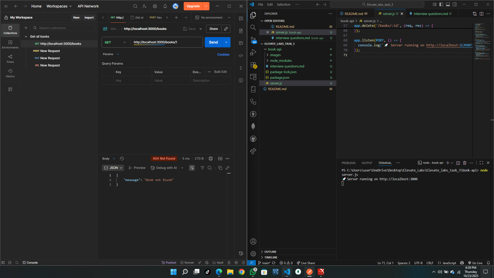
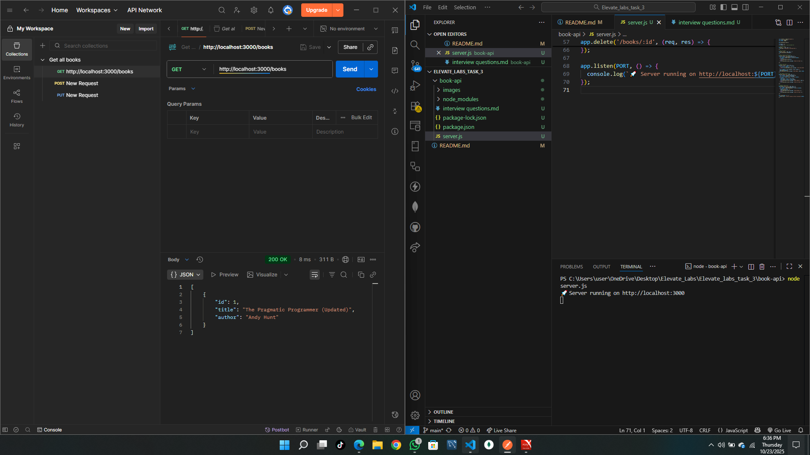
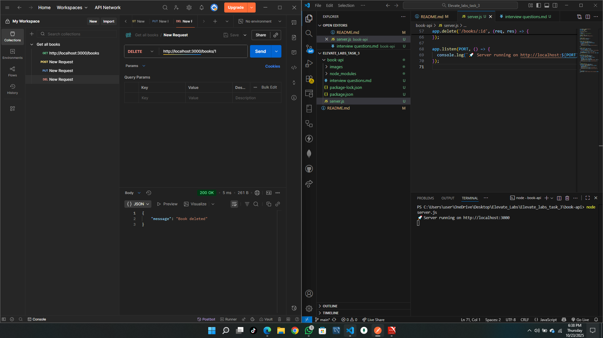
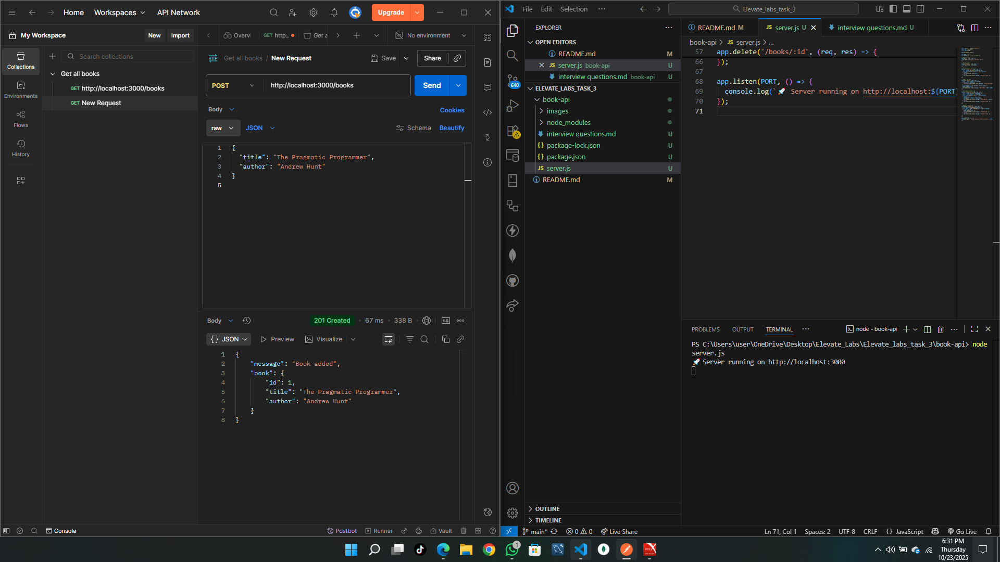
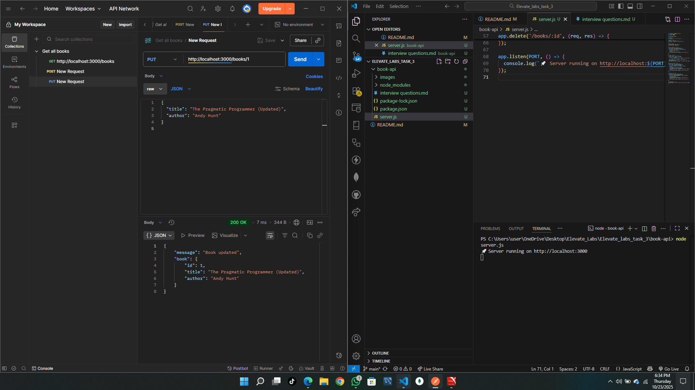
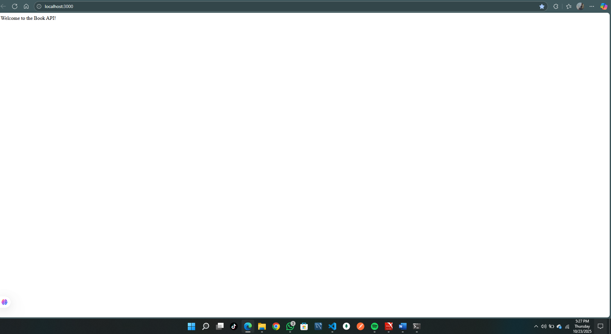
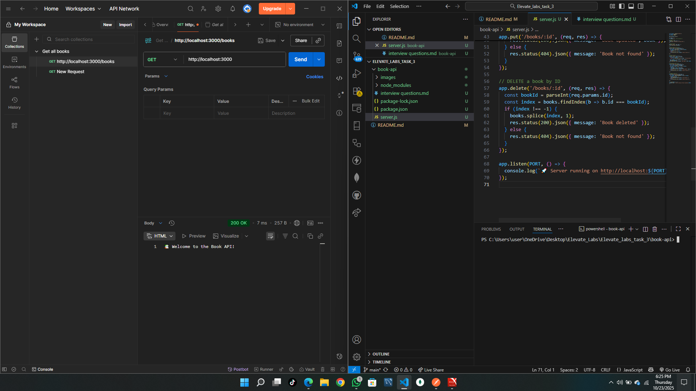

# 📚 Book API

A simple REST API built with Node.js and Express to manage a list of books.

## 🚀 How to Run
1. Clone the repo
2. Run `npm install`
3. Run `node server.js`
4. Test endpoints using Postman at `http://localhost:3000`

## 📌 Endpoints
| Method | Endpoint        | Description              |
|--------|------------------|--------------------------|
| GET    | `/books`         | Get all books            |
| GET    | `/books/:id`     | Get a book by ID         |
| POST   | `/books`         | Add a new book           |
| PUT    | `/books/:id`     | Update a book by ID      |
| DELETE | `/books/:id`     | Delete a book by ID      |

## 🧪 Tools Used
- Node.js
- Express.js
- Postman

## 🎯 Key Concepts
- REST API
- Express Routing
- HTTP Methods
- JSON Handling

